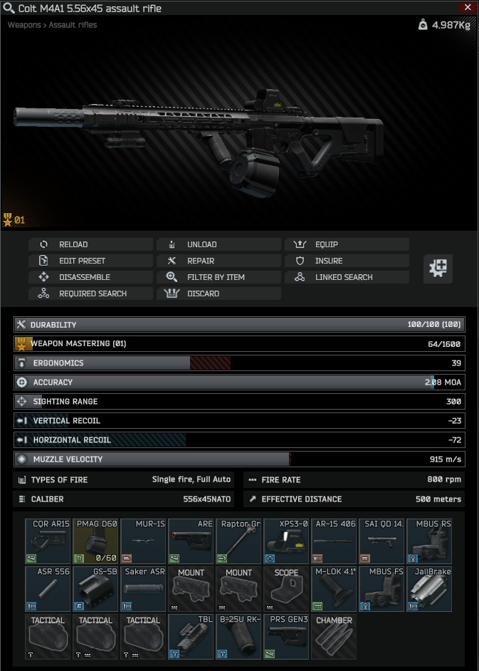
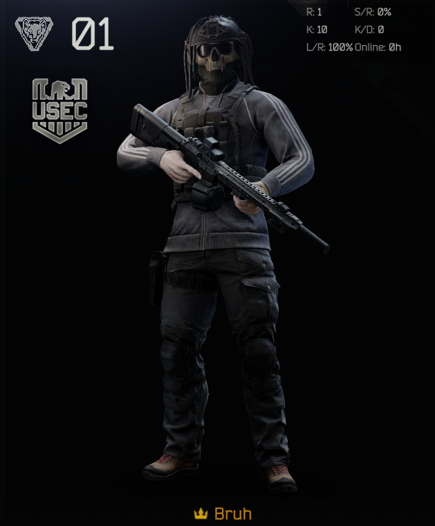
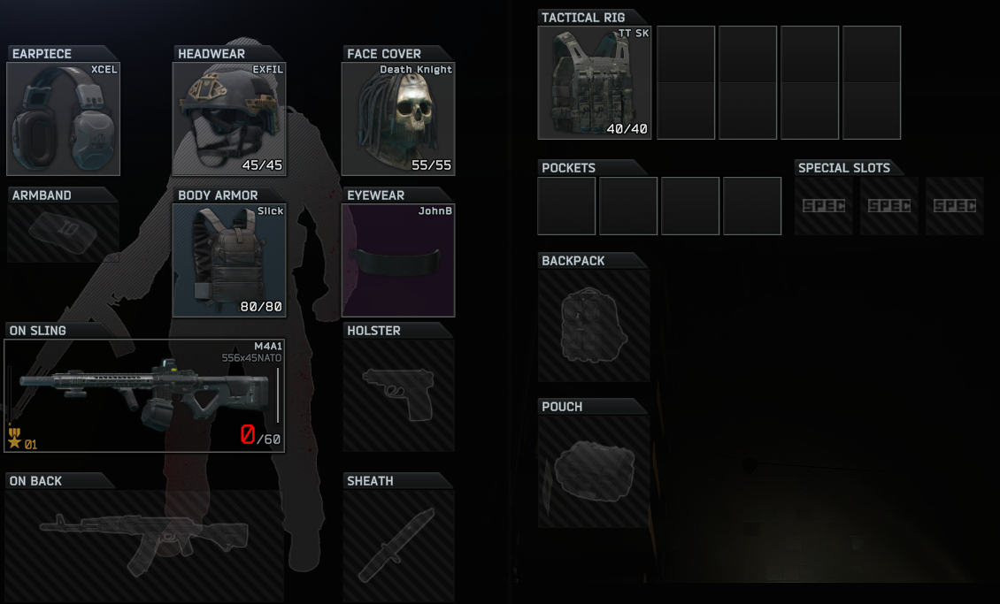
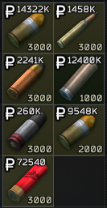
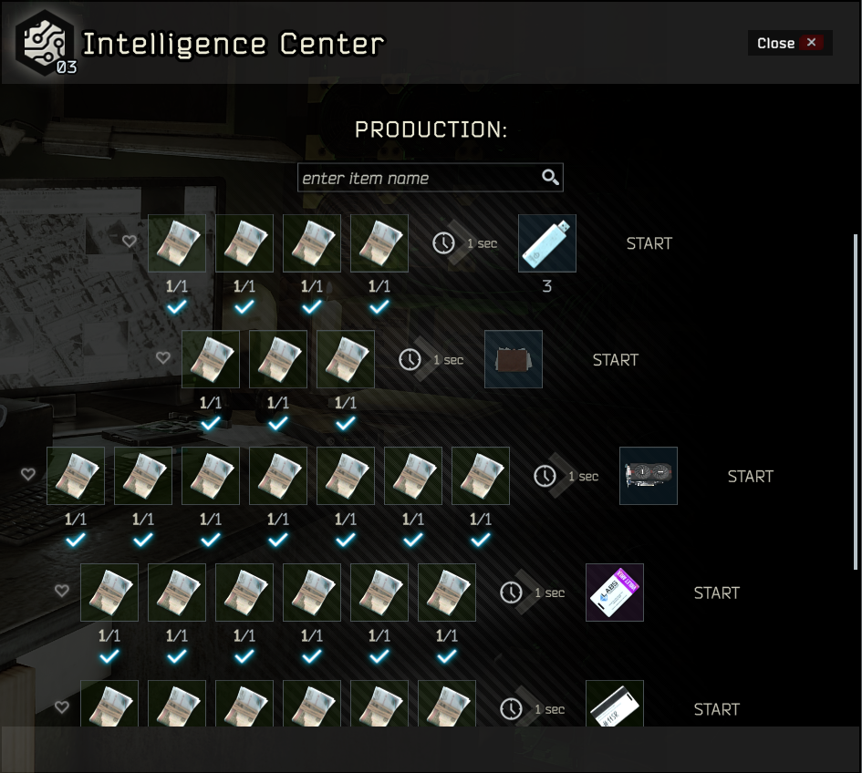
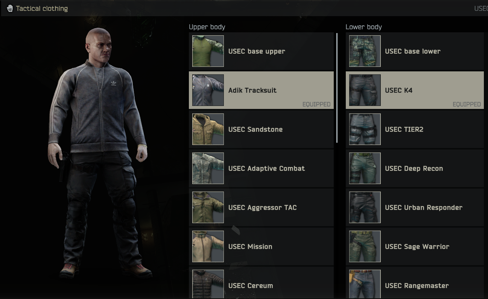
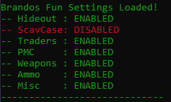
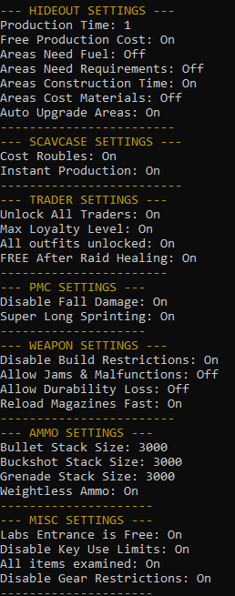

# ***Fun Settings***
> Run and gun and mostly have fun changes for [Single Player Tarkov (SPT).](https://hub.sp-tarkov.com/files/file/1311-fun-settings/)

|||||
|||||

# ***Installation***
1. Locate where you installed SPT-AKI
2. Download and Unzip FunSettings from [Releases](https://github.com/BrandoTheDev/FunSettings/releases/download/v3/BrandoTheDev-FunSettings-3.9.2.zip)
3. Move entire folder into SPT-AKI/user/mods/

# ***Config Settings***
> (Config file is in the FunSettings folder -> config folder -> config.json)
- showOptions: Displays all the options enabled in the server's console.
### ***Hideout***
- ***Enabled***: Enable or disable the these Hideout options
- ***ProductionTime***: How long it takes to craft in seconds
- ***ProductionCostRoubles***: Changes crafting materials into Roubles
- ***AreaNeedsFuel***: Allows the area to craft without fuel
- ***AreaNeedsRequirements***: Upgrade areas without the needed skills/levels/loyalty
- ***AreaMaxWhenUpgraded***: When you click upgrade it will continue to upgrade until max level
- ***AreaConstructionTime***: How long it takes to construct an area
- ***AreaCostMaterial***: Construct areas for free
  
### ***Scavcase***
- ***Enabled***: Enable or disable these Scavcase options
- ***CostRoubles***: Switches the materials into Roubles
- ***InstantProduction***: Cooldown is 1 second on retrieving items
  
### ***Traders*** 
- ***Enabled***: Enable or disable these Trader options
- ***unlockAll***: Unlocks all Traders (Gives Jaeger right away)
- ***maxLoyaltyLevel***: Increase your standing to max level
- ***AllOutfitsUnlocked***: Unlock all outfits for your bear or usec
- ***freeTherapistHealing***: Free healing after raids on the healing screen 

### ***PMC***
- ***Enabled***: Enable or disable these PMC options
- ***disableFallDamage***: Allows falling from any height
- ***superLongSprinting***: Basically Infinite Sprinting
    
### ***Weapons*** 
- ***Enabled***: Enable or disable these Weapon options
- ***disableRestrictions***: Allows gun parts that otherwise block each other go together
- ***CanJamOrMalfunction***: Stops the weapon from jamming or malfunctioning
- ***CanLoseDurability***: Stops the weapon from losing any durability
- ***superFastMagazineReload***: Load/Unload a magazine really fast
        
### ***Ammo***
- ***Enabled***: Enable or disable these Ammo options
- ***bulletStackSize***: Maximum amount of RIFLE/SMG/PISTOL ammo in a stack
- ***buckshotStackSize***: Maximum amount of SHOTGUN ammo in a stack
- ***grenadeStackSize***: Maximum amount of GRENADE LAUNCHER ammo in a stack (Not Hand Grenades)
- ***weightlessAmmo***: Force the ammo weightless so a stack wont weigh you down!
        
### ***Misc***
- ***Enabled***: Enable or disable these Misc options
- ***freeLabsEntrance***: No Access Keycard needed
- ***unlimitedKeyUses***: Keys are back to unlimited uses
- ***allItemsExamined***: All items will be examined
- ***disableGearRestrictions***: Gear that blocks each other from wearing can be worn together

